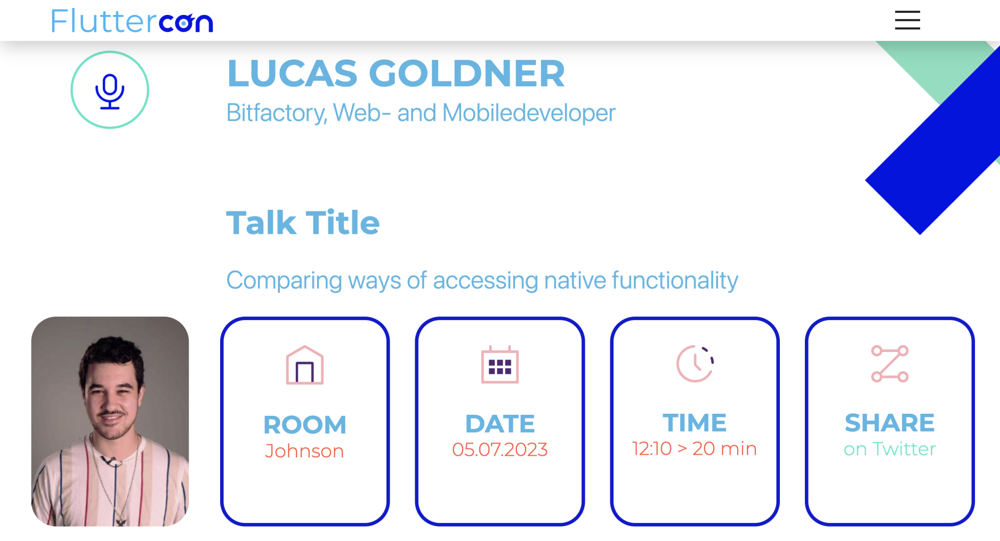
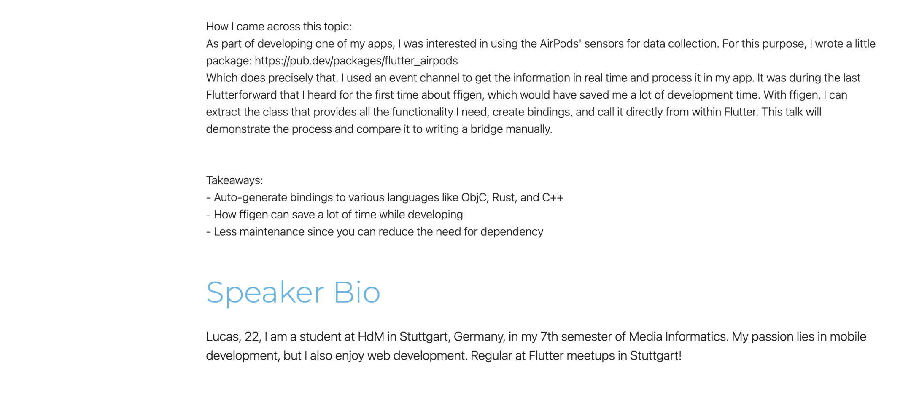

# fluttercon_2023_presentation

An unique experience. A Flutter experience!
Presentation slides, but made in Flutter for the https://fluttercon.dev/ 2023.
Here is my speaker page: https://fluttercon.dev/lucas-goldner/



## Presentation ressources

Contains airpods example using ffigen:

- [FFIGen Demo](https://github.com/lucas-goldner/ffi_gen_demo)

Used for presentation:

- [Airpods Gate](https://github.com/lucas-goldner/airpods-gate)
- [Airpods Transmitter](https://github.com/lucas-goldner/airpods_transmitter)

Why are there two more repos besides this one?
My initial idea of this presentation was to call the AirPods API natively, but guess what
Coremotion is not supported on macOS T-T. So I had to make a transmitter app on my iPhone
that continuously sends me my AirPods data to a WebSocket server, which sends me that data
directly to this presentation... But hey, at least it works now :D

## Getting Started

_Warning:_ Only tested on macos, no idea how it looks like on other platforms.

To run the base project use:

```
$ flutter pub get
# If fluttergen is not installed go here: https://pub.dev/packages/flutter_gen
$ fluttergen
# If language files were not generated
$ flutter pub run intl_utils:generate

# Run the app finally
$ flutter run -d macos
```

!To run the complete presentation, also clone Airpods Gate & Airpods Transmitter and run them before running this presentation
